# FREE AWS Cloud Project Bootcamp

- Application: Cruddur
- Cohort: 2023-A1

This is the starting codebase that will be used in the FREE AWS Cloud Project Bootcamp 2023

## Instructions

At the start of the bootcamp you need to create a new Github Repository from this template.

## Journaling Homework

The `/journal` directory contains

- [x] [Week 0](journal/week00.md)
- [x] [Week 1](journal/week01.md)
- [x] [Week 2](journal/week02.md)
- [x] [Week 3](journal/week03.md)
- [x] [Week 4](journal/week04.md)
- [x] [Week 5](journal/week05.md)
- [x] [Week 6](journal/week06.md)
- [x] [Week 7](journal/week07.md)
- [x] [Week 8](journal/week08.md)
- [x] [Week 9](journal/week09.md)
- [x] [Week 10](journal/week10.md)
- [x] [Week 11](journal/week11.md)
- [x] [Week 12](journal/week12.md)

## Completed Project
### Final Logical Diagram
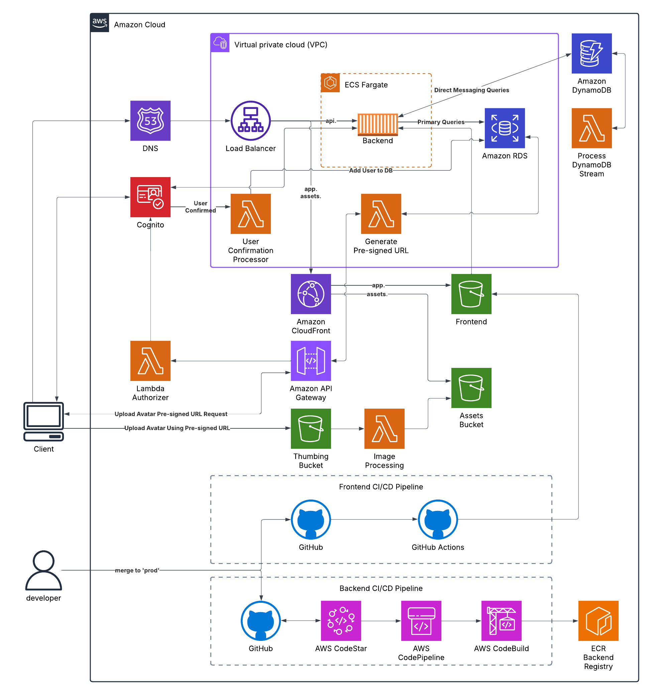

### CloudFormation Stacks
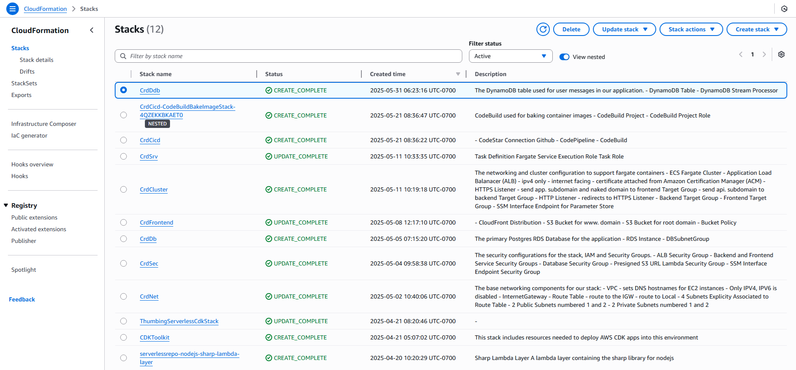

### Route 53 Records
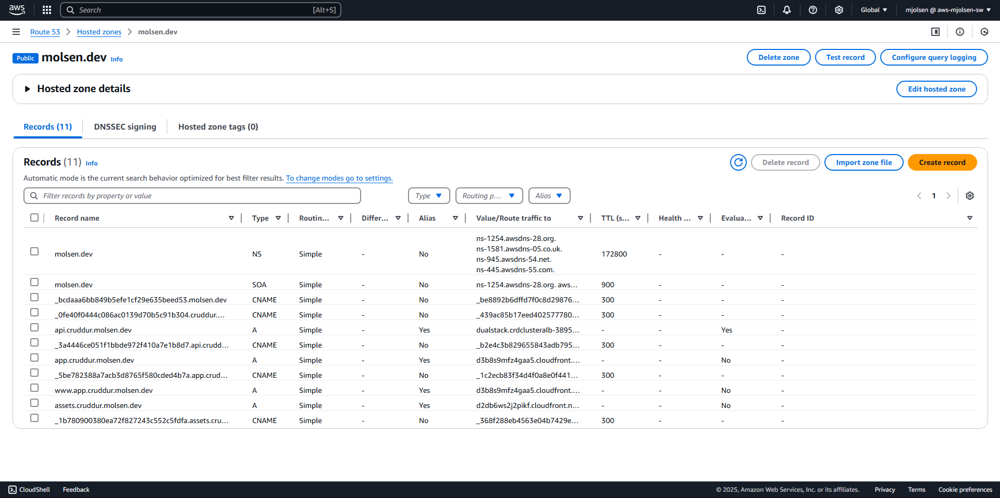

### Backend Service
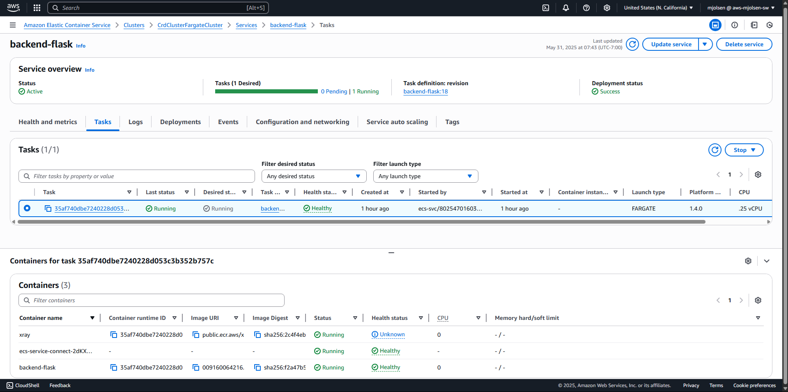

### S3 Buckets

### Lambda Functions
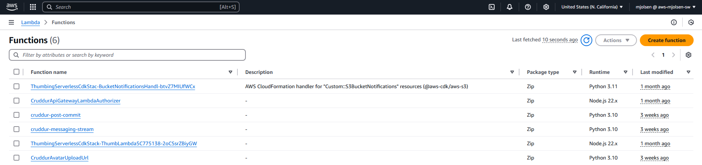

### Application Images
#### Sign Up
First step in user creation through Cognito. Requires confirming email.

#### Confirmation
Confirming email through Cognito triggers a lambda function to create user in DB.
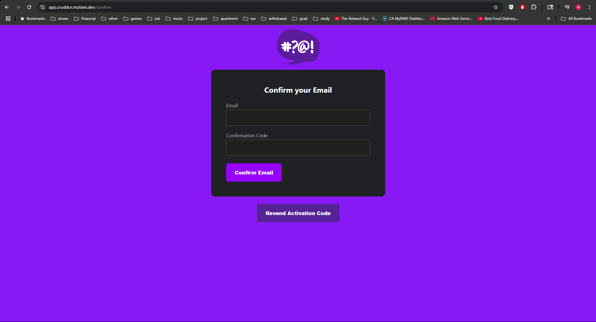
#### Home
List of all non-reply messages on the platform without pagination.
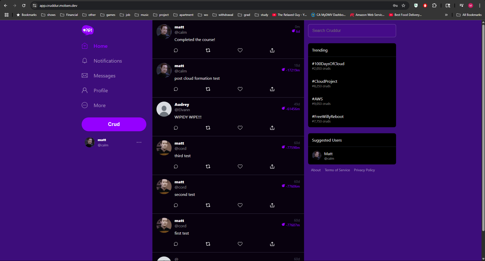
#### Create Post
Basic post creation.
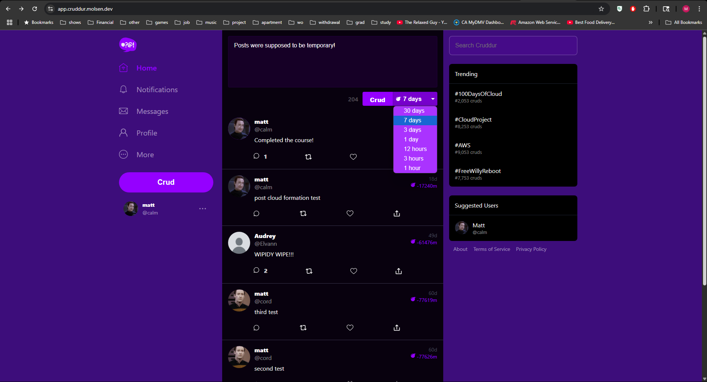
#### Create Reply
Create reply linked to a post. Can be viewed when clicking into original post.

#### Show Activitiy
Shows a post and all of its replies.
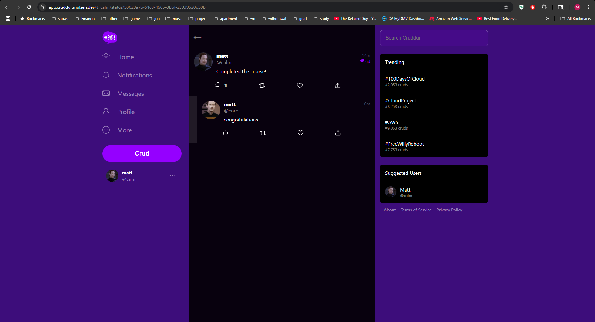
#### Search
Filter posts for name, handle, or message (done completely on the frontend).
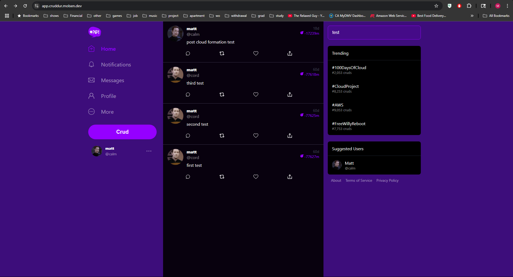
#### Profile
Shows basic user information from database.
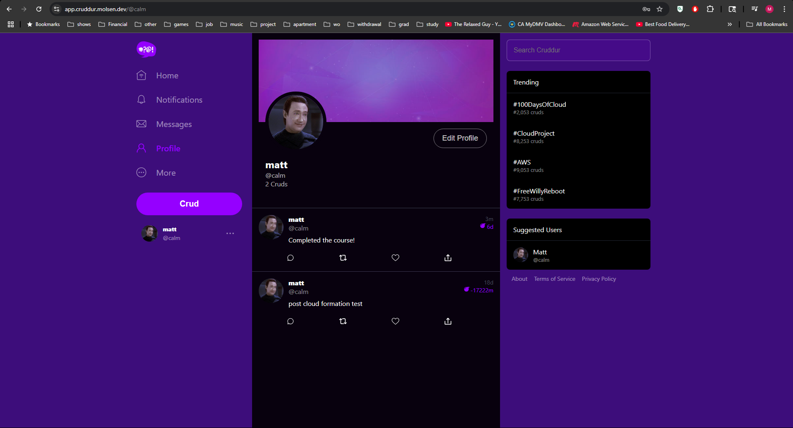
#### Profile Form
Allows updating of display name, bio, or to upload an avatar.
Generates pre-signed URL for S3 upload by calling API Gateway, passed a lambda authorizer, and calling a lambda.
Sends image to pre-signed URL triggering a lambda to process and outputing to bucket read by CloudFront.
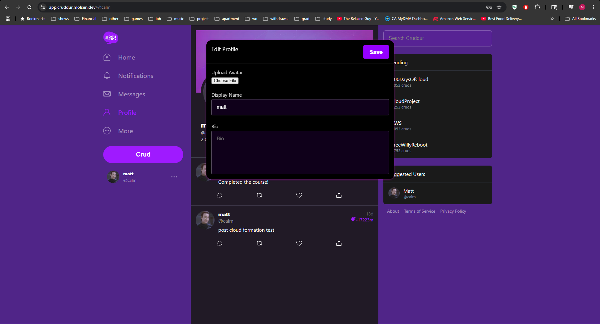
#### Messages
Messages managed by DynamoDB and processed by a lambda triggered by the DynamoDB stream.
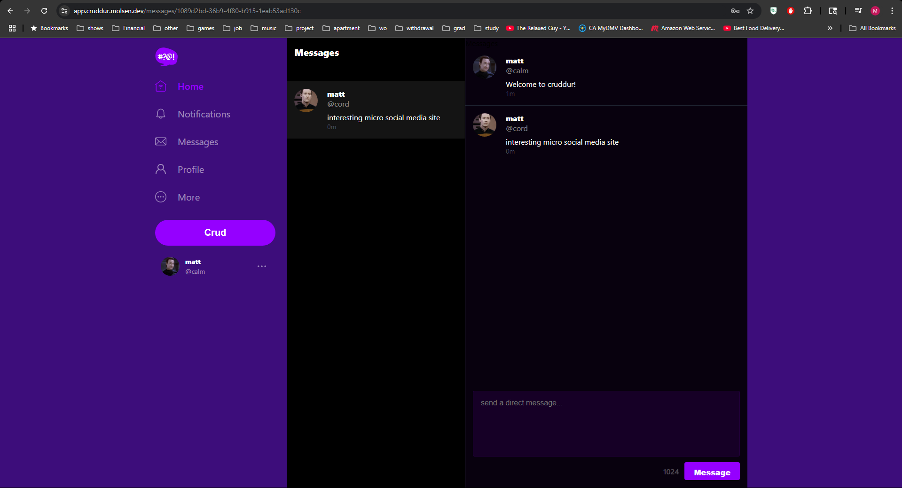

## Not Completed in Project (To be potentially completed)
- [x] 'Search Cruddur' - **COMPLETED**
  - ~~I'm assuming this would be a simple activity search function.~~
    - ~~Could do a basic implementation the returns a flat list of activities that contain what is searched (dumb search).~~
    - ~~Would benefit to have replies linking to the activity their replying to.~~
  - Simple search given no pagination. Filtered activities in HomeFeedPage and UserFeedPage while filtered replies in ActivitiyShowPage.
- [x] Clean up User Profile Form - **COMPLETED**
  - ~~Add the ability to upload a banner.~~
  - Update the upload avatar button to be more explicit.
- [ ] Notifications Page
  - The expectations for what to show in the `/notifications` route remained undefined and stubbed. This prevents plans to complete this.
- [ ] '... More'
  - The intention of this was never defined in the bootcamp, so it will remain untouched.
- [ ] Real-time messaging with AppSync
  - AppSync was not covered in the bootcamp. Completion requires a personal study and implementation. Potential frontend changes would be required, especially if we want something similar to how modern social media handles messages (it would effectively require a miniature application).
- [ ] Deletion of expired posts
  - This would require a Lambda Function that would delete a post and recursively delete its children replies. There would also need to be a mechanism to schedule the function calls.
    - Recurssive deletions of replies can be simplified by replies taking on the expiration time of the message they are replying to.
    - The function schedules the next function call to be the min of the next expiration time or the minimum life span of a new post (1 hour).
- [ ] Likes
  - This would involve a small DB redesign, some query changes, additional backend route(s), and updates to the frontend.
    - DB redesign: Currently uses an integer to count likes. There should be a seperate table with two fields (user_uuid, activity_uuid) to match users to liked posts.
    - Query changes: Like counts would be aggregated dynamically when post data is retrieved. A field should be returned indicating whether the user requesting the data liked the particular post. When returning from liking/unliking, a new count of the likes should be returned to update the frontend.
    - Backend routes: Outside of the query changes, there need to be route(s) to like/unlike a post given the user_uuid (potentially their cognito_uuid as this would be provided through the required authentication and would save a call to the DB) and activity_uuid.
    - Frontend updates: Needs to track whether or not to highlight to like button depending on if the user has liked the post. Also needs to use the correct route(s) for liking/unliking. Should update the like count after liking/unliking based on the value returned from the backend.
- [ ] Shares and Reposts
  - Similar in functionality and would have to be designed. Would these have the same lifespan as the original message or do we need to redesign our activity setup? Decisions on how these function on the frontend would have to be decided. Based on how open this is, this is unlikely to be implemented.
- [ ] New Message Groups
  - Currently, to message a user that you haven't messaged before you need to manually use the route `/messages/new/{handle}'. Could implement a way to navigate to this page.
- [ ] Upload Banner Pipeline
  - Would be practically identical to the avatar upload pipeline.
- [ ] Unit Tests
  - No testing, outside of manual testing, were used in this bootcamp. Could implement unit tests for both the backend and frontend. These could be leveraged by CI/CD pipelines (CodePipeline and GitHub Actions respectively).
- [ ] Trending
  - Would require some form of machine learning which is outside the scope of what I wanted from this project, making it highly unlikely to be implemented. Also, have messages deleted consistently would provide a potential challenge to the models.
- [ ] Suggested Users
  - Would also require some form of machine learning. Along with being outside the scope of the project, there are not going to be a large number of users making this highly unlikely to be implemented.
- [ ] 'About', 'Terms of Service', 'Privacy Policy'
  - Will remain just stubs as this is not a real social media platform.
- [ ] Use an Auto Scaling Group (ASG) for the backend task.
  - While there is no expected traffic spikes expected, it would be good practice to use an ASG in the backend target group.