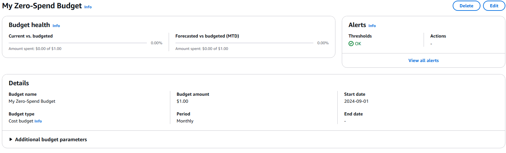
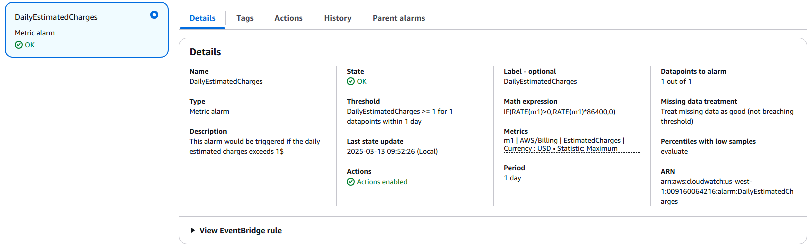
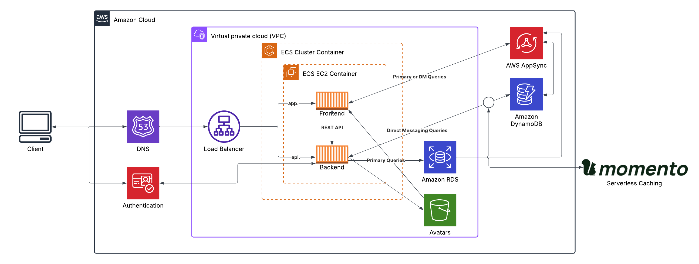

# Week 0 — Billing and Architecture

### Install AWS CLI
```sh
curl "https://awscli.amazonaws.com/awscli-exe-linux-x86_64.zip" -o "awscliv2.zip"
unzip awscliv2.zip
sudo ./aws/install
```

### Check that the AWS CLI is working and you are the expected user
```sh
aws sts get-caller-identity
```

You should see something like this:
```json
{
    "UserId": "AIFBZRJIQN2ONP4ET4EK4",
    "Account": "655602346534",
    "Arn": "arn:aws:iam::655602346534:user/mjolsen"
}
```

### Create AWS Budget
- Manually created free-tier budget for $1 spend.


### Create AWS Cloudwatch Alarm
- [aws cloudwatch put-metric-alarm](https://docs.aws.amazon.com/cli/latest/reference/cloudwatch/put-metric-alarm.html)
- [Create an Alarm via AWS CLI](https://aws.amazon.com/premiumsupport/knowledge-center/cloudwatch-estimatedcharges-alarm/)
- We need to update the configuration json script with the TopicARN we generated earlier
- We are just using a json file because --metrics is required for expressions and it's easier to use a JSON file.
- Json file used: [alarm_config.json](https://github.com/mjolsen-sw/aws-cruddur/blob/main/aws/json/alarm_config.json)

```sh
aws cloudwatch put-metric-alarm --cli-input-json file://aws/json/alarm_config.json
```



### Logical Architectural Design of Application
- [Link to Cruddur Logical Diagram](https://lucid.app/lucidchart/bc1bc027-2bf5-43e0-ad09-948391356f60/edit?viewport_loc=-316%2C-40%2C2992%2C1473%2C0_0&invitationId=inv_6f7aaa06-f08d-41c1-8883-26557e762317)

