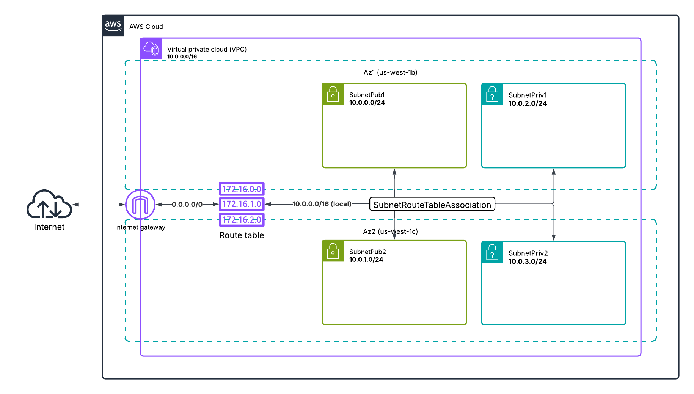

# Week 10 — CloudFormation Part 1
## cfn-toml
To pass paramaters to our cfn templates we're using `cfn-toml`.
You'll neeed to install the following:
```sh
apt install ruby-dev
gem install cfn-toml
```
> https://github.com/teacherseat/cfn-toml
## CloudFormation
### Networking
The base networking components including VPC, subnets, availability zones, internet gateway, route table, and routes.
#### Template, Configurations, and Deployment
CloudFormation template: `aws/cfn/networking/template.yaml`
Configurations: `aws/cfn/networking/config.toml`
Deploy script: `bin/cfn/networking`
#### Diagram

### Cluster

#### Template, Configurations, and Deployment
CloudFormation template: `aws/cfn/cluster/template.yaml`
Configurations: `aws/cfn/cluster/config.toml`
Deploy script: `bin/cfn/cluster`
#### Diagram
