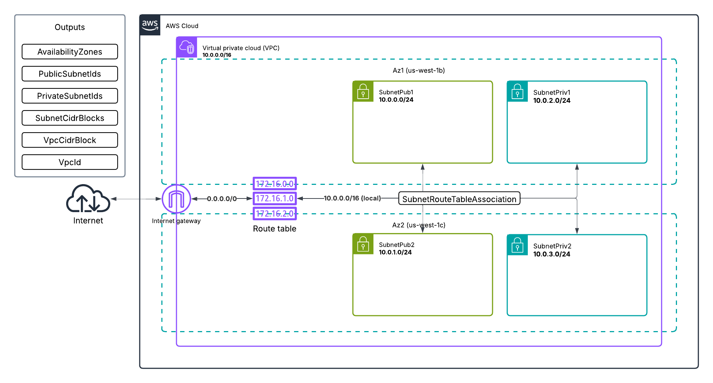

# Week 10 — CloudFormation Part 1
## cfn-toml
To pass paramaters to our cfn templates we're using `cfn-toml`.
You'll neeed to install the following:
```sh
apt install ruby-dev
gem install cfn-toml
```
> https://github.com/teacherseat/cfn-toml
## CloudFormation
### Networking
The base networking components including VPC, subnets, availability zones, internet gateway, route table, and routes.
#### Template, Configurations, and Deployment
CloudFormation template: `aws/cfn/networking/networking.yaml`
Configurations: `aws/cfn/networking/config.toml`
Deploy script: `bin/cfn/networking`
#### Diagram

### Security
IAM and Security Groups needed by multiple other templates.
#### Template, Configurations, and Deployment
CloudFormation template: `aws/cfn/security/security.yaml`
Configurations: `aws/cfn/security/config.toml`
Deploy script: `bin/cfn/security`
### DB
Postgres RDS for the application
#### Template, Configurations, and Deployment
CloudFormation template: `aws/cfn/db/db.yaml`
Configurations: `aws/cfn/db/config.toml`
Deploy script: `bin/cfn/db`
### DDB
DynamoDB Table and connects DynamoDBStream processing Lambda function.
#### Template, Configurations, and Deployment
CloudFormation template: `aws/cfn/ddb/ddb.yaml`
Configurations: `aws/cfn/ddb/config.toml`
Deploy script: `bin/cfn/ddb`
### Cluster
ECS Cluster and Load Balancer
#### Template, Configurations, and Deployment
CloudFormation template: `aws/cfn/cluster/cluster.yaml`
Configurations: `aws/cfn/cluster/config.toml`
Deploy script: `bin/cfn/cluster`
### Service
Backend ECS Service and Task Definition
#### Template, Configurations, and Deployment
CloudFormation template: `aws/cfn/service/service.yaml`
Configurations: `aws/cfn/service/config.toml`
Deploy script: `bin/cfn/service`
### CICD
CI/CD using CodeBuild and CodePipeline
#### Template, Configurations, and Deployment
CloudFormation template: `aws/cfn/cicd/cicd.yaml`
Configurations: `aws/cfn/cicd/config.toml`
Deploy script: `bin/cfn/cicd`
#### Confirmation

